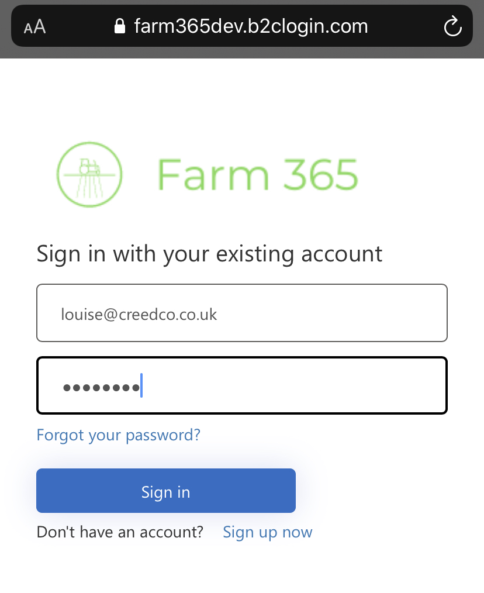
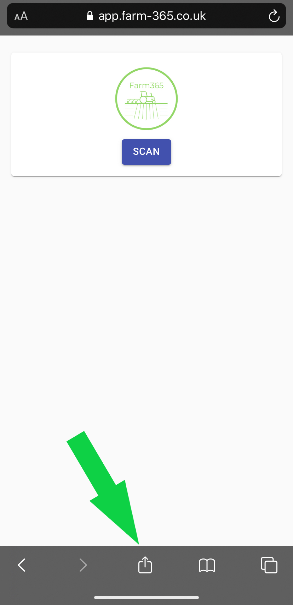
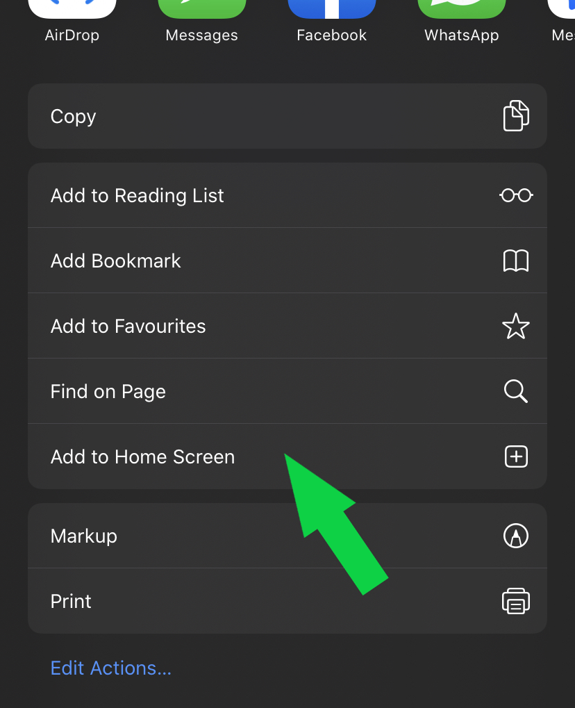
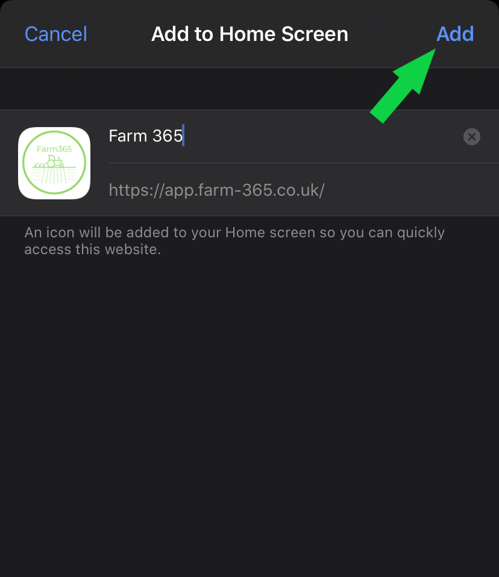

# Pinning the app to your home screen 

To make Farm 365 more accessible and staying as up to date as we can with the ever changing guidelines in the agricultural  industry the app is not accessible through the app store. 
 
## I phone 
1. Follow the link to sign in
2. Sign in with email address & password

3. At the bottom of your screen find and touch on the ‘share’ icon 

4. Select ‘add to home screen’ 

5. Your devise will default to saving it as Farm 365 but you can change this if you require

6. Touch on ‘add’

7. The app will now appear on your devices home screen 
